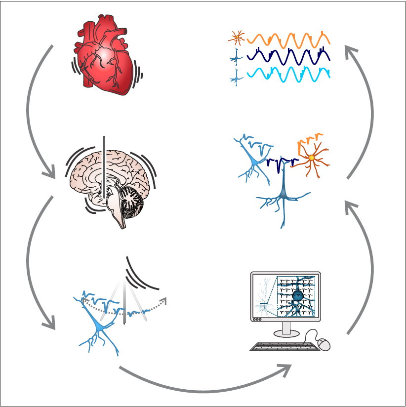

# "Cellular classes in the human brain revealed in vivo by heartbeat-related modulation of the extracellular action potential waveform" (Mosher*, Wei* et al, Cell Reports, 2020)




## Instructions
### Download morphology from allsdk
   * Install [allensdk](https://alleninstitute.github.io/AllenSDK/install.html).
   ```sh
   cd codes
   jupyter-notebook Yina_download_morph_step1.ipynb # Download the morphology
   ```

   * Calculate rotation angels for simulations.
   ```sh
   jupyter-notebook Yina_cal_rotation_angle_step2.ipynb #calculate the rotation angle for the cell to make sure that the apical dendrites ascend toward the pia in the simulation.
   ```
   
   
     

### Run simulations

   * Install bmtk and create an enviroment(for example, we named it "bmtk_ateam"). 
      Please follow the instructions in this [link](https://github.com/AllenInstitute/bmtk).
   * Compile the modfiles
      After installing bmtk, run 
      ```sh
      cd examples/biophys_components/mechanisms 
      nrnivmodl modfiles/ # this should create a directory x86_64
      ```
      If you have trouble in this step, make sure you have deleted "x86_84" before compling the modfiles.

      In the folder "571654895_example", run the simulations using the following commands:
      ```
      python build_network.py
      python run_bionet.py
      ```
### Run EAP analysis:
   
   ```
   cd codes/
   jupyter-notebook Yina_EAP_analysis_step4.ipynb
   ```
   to calculate and save extracellular action potential (EAP) of each electrode recordings for further analysis. 

In the "assets" folder, we have included the .json files and morphologies for all the models. We also included the templates for simulations, use build_network_in.py for inhibitory aspiny cells, and build_network_pc.py for excitatory spiny cells. For each cell, one need to change parameters ROTX,ROTZ,CELLID,POPNAME, accordingly. You can find this information here:
      
```sh
cd assets/morphologies
vi human_celltypes_table.csv
```
